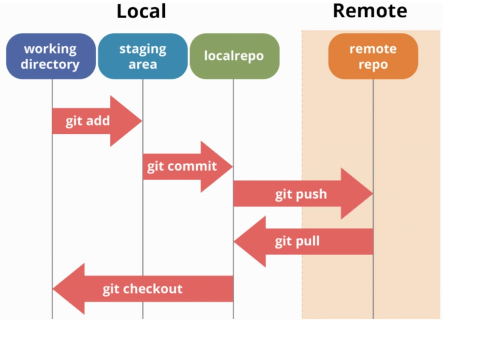

# Git, Github

## Goals 
- git을 왜 사용하는가?
- git을 사용하기 위해서 CLI Command 사용방법
- git과 github의 차이의 이해 
- git bash와 친해지기
- git 대략적인 역사

---

### Git은 왜 사용하는가
- git은 형상관리 즉, 소스 및 많은 개발자들이 개발의 편의하게 만들어진 형상관리 프로그램이다 
  - VSC(Version Control Sytem), SCM(Source Code Management)라고 부른다, 추가적으로 상위 개념인 Software Configuration Management)가 있다.
- Git을 사용하는 이유가 되는 장점 
  - 빠른속도, 단순한 구조 
  - 분산형 저장소 지원
  - 비선형적 개발 가능(브랜치를 이용한 다중 작업가능)

### Git을 사용하기 위해서 CLI Command 사용방법
- Git install
    - [Window_Git_Install](https://gitforwindows.org) 확인
    - [Mac_Git_Install](https://git-scm.com/book/ko/v2/%EC%8B%9C%EC%9E%91%ED%95%98%EA%B8%B0-Git-%EC%84%A4%EC%B9%98) 확인
    - git 설치 확인 명령문

```bash
# git의 버전확인으로 쉽게 확인할 수 있다.
$ git --version
```
- Git 구조 이해
 

- TEST 

