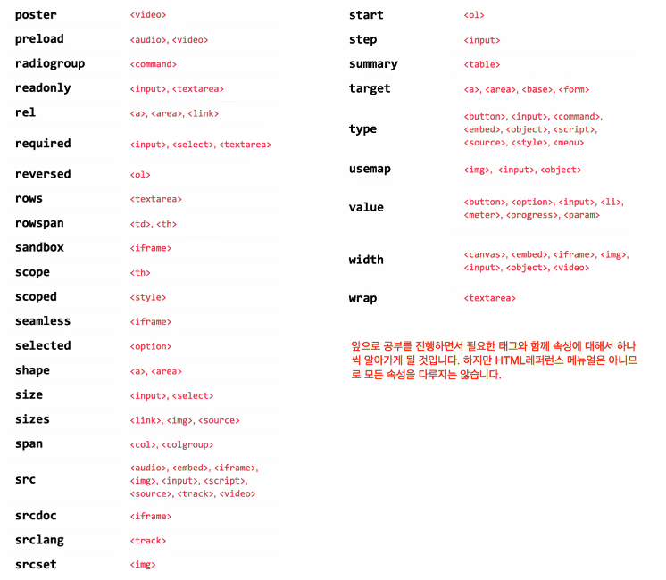
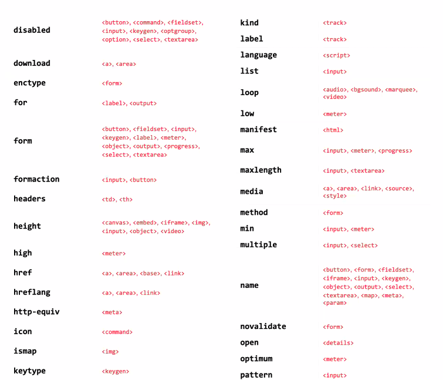
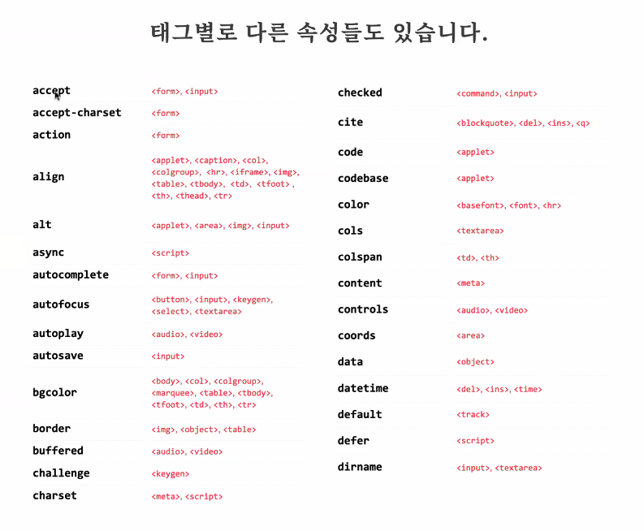

# Html Sytem UnderStanding!

## Goals

1. Html을 이해하기 전의 전반적인 CS의 이해와 시스템 이해
   1. 컴퓨터 메모리의 이해
   1. 메모리로 이해하는 프로그래밍 언어
1. 프로그래밍 코드의 처리
1. Browser에서의 Front_End(Html, Css, js) 시스템 이해
   1. WWW
   1. 브라우저 통신 과정
   1. 메모리로 이해하는 HTML 시스템

---

### Html을 이해하기 전의 전반적인 CS의 이해와 시스템 이해

HTML을 시작하기전에 컴포터 메모리 및 구조에 대해서 알아보고  
Html와 Browser의 시스템을 알아보자.

1. 컴퓨터 메모리의 이해

- 컴퓨터에서 메모리란?  
  전류, 입력신호에 따른 메모리 저장소에 주소 혹은 값을 1,0을 통해 저장하여  
  CPU에 요청에 따른 값을 출력하는 기억장치

- 1,0으로 표현하는 메모리주 주소 값과, 그 값을 저장하는 표를 만들게 되었고
- 기술의 발전으로 값을 저장하는 가지수가 이진수에서, 16진수 증가 하며, 컴퓨터의 다양한 기능이 생겼다
- 메모리, 주소 값 과 또 메모리 객체를 저장하여 컴퓨터와 사람 사이에 통신할 수있는 경우수가 많아졌다
  - 예시 (UTF-8) : 글자 클릭 -> 해당 입력 메모리를 -> utf-8 사전 -> 서체.tiff 변환 -> 화면 led 입력 출력으로 변환 -> 화면이 보여짐
- **여기서 주소의 안에 주소를 저장하는 경우를 포인터라 작명했다 **

_즉, 메모리의 저장방식을 주소와 값을 이용하여 사전을 만들고 해당 입력에 대한 값을 찾아 다시 표현하는 방식으로 기계와 통신하게 되었다._

---

### 프로그래밍 코드의 처리

1. 사람이 소스 코드 입력
1. 토큰 처리  
   lexer - 자신의 규칙을 이용해서 코드를 세분화 하여 의미 부여 코드로 변환
1. AST  
   어셈블러 형식으로 수행 할 수 있는 형태로 의미 부여(트리구조 사용)
1. 어셈블러  
   AST를 이용해서 어셈블러 형식으로 번역
1. 기계어 변환(머신코드)  
   1, 0으로 변환
1. RAM 메모리 할당
1. CPU 계산작업 요청
1. 결과 값 도출

- C#, HTML의 차이  
  2~5번 작업을 컴파일러가 하고 수행할지 바로 작동해서 표현할지의 차이, 전자 C#, 후자 HTML

---

### Browser에서의 Front_End(Html, Css, js) 시스템 이해

- Browser란?  
  일종의 가상 머신으로 HTML, CSS, JS를 해석할 수 있는 기능을 가지고 있어 가상의 환경처럼 3가지  
  파일을 읽어 웹을 표현 해주고 혹은 많은 기능을 지원한다.(웹, 게임, 비디오 플레이어)

- Http, Https?  
  HyperText Text Protocol이라고 하며, PC와 서버의 통신하기 위한 일종의 약속이다.

- 우리가 웹페이지를 보는 과정

1. 사용자 url로 요청 -> 도메인 서버 -> 필요 ip 프로토콜 생성
1. http 프로토콜 규약으로 전달 데이터 정규화
1. 인터넷 망으로 데이터 전달(WWW)
1. 서버에서 데이터 받음  
   메모리를 여기서 생각할 수 있음 각자 서버 데이터에서 메모리를 각자 사전에 맞게 변환하여 결과 도출
1. Response Data는 사용자 브라우져에서 다시 랜더링
1. 화면에 표시

_ 여기서!!!! 아래 내용으로 Tag기준으로 Browser가 Html을 표현하는지 이해해보자_

---

### HTML Tag Convert!!! in Browser

1. HTML코드를 인식 (Charset의 내용으로 2진수 저장)

```html
<--시작-->
<html>
  <head></head>
  <--자식 1-->
  <body>
    <--자식 2-->
    <div></div>
    <--자식2의 자식-->
  </body>
</html>
```

2. Token처리  
   lexer가 tag에 따른 의미 부여를 하는 코드를 생성하고 DOM생성자가 해당 tag에 맞는 데이터를 생성
1. DOM의 객체 생성한다. 정보 뭉치의 객체이다.
1. Browser 랜더링 엔진(blink, webkit, getko)로 해석 한다.
1. Browser 화면에 표시

_개발자 도를 통해 지금 필요 객체를 다 메모리에 가지고있으며 script는 저장된 메모리에 접근하여 수정하여 변화를 준다._

_여기서 tag를 읽는 중 script를 만나면 연결된 js 파일을 다운로드 하고 js를 읽는 작업을한다._

---

### 알아두면 좋은 지식!!!

- 개발은 모두 소문자로 구현하는 것을 관례로 한다.
- 속성은 관례적으로 "" 사용한다.
- 속성 값의 이름과 값을 정하는 이유는 DOM 구성에서 처리하기 위함이다.
- 태그마다 사용할 수 있는 속성들이 있다.(이미지 첨)






