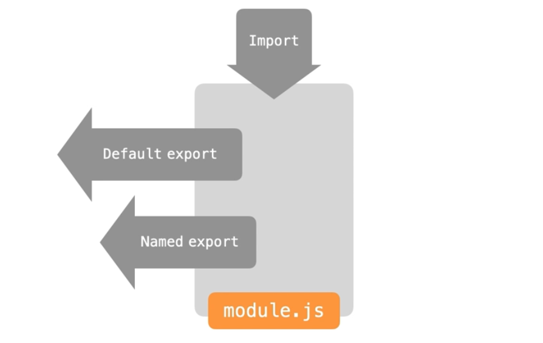

# JS 데이터 실습

## Goals

1. import, export
1. lodash 사용법
1. JSON 알아보기
1. Storage

---

### import, export

- import : 외부의 js파일을 가져울 수 있는 하나의 경로가 있다

- export :

  - default export : 이름의 지정 없이 data를 내보낼 수 있다.
  - named export : 이름을 지정해서 data를 내보내야한다.

- default export
  - 하나의 데이터만 내보낼 수 있다.

```js
//getTpye.js
export default getType(){
  //실행문
}
```

```js
// another.js
import getType from "filePath";

getType();
```

- named export
  - 여러개의 데이터를 내보낼 수 있다.
  - as 키워드를 통해서 원하는 이름으로 변경해서 사용할 수 있다.
  - default와 named export 두가지 모두 사용할 수 있다.

```js
//getType.js
export getType(){
  //실행문
}

export const user  = {age:20, name:'david'}

```

```js
//namedExport.js
import { getType, user as anotherName } from "./getType.js";

console.log(getType());
console.log(user);

// 한번에 데이터를 모두 가져오는 방법이고 wildcard에 모든 데이터를 가져온다.
import * as R from "./getType";

console.log(R.getType());
console.log(R.user);
```

- export, import 구조
  

---

### lodash 사용법

- 설치

```bash
# npm을 통한 npm  초기화 설정
$ npm init -y

# npm을 통해서 lodacsh 설치
$ npm install lodash
```

- lodash 사용 함수

  - .unionBy(배열1, 배열2, 중복키워드), .uniqBy(배열, 중복키워드)  
    _중복 키워드를 제거하여, 새로운 함수를 리턴한다._

```js
// 통상적인 _ 사용이고, 이름은 개발자 마음대로 사용할수있다.
import _ from "lodash";

const A = [
  { userId: "1", name: "Heropy" },
  { userId: "2", name: "Neo" },
];

const B = [
  { userId: "1", name: "Heropy" },
  { userId: "2", name: "Smith" },
];

const C = A.concat(B);
// userId와 이름이 중복되는 환경이 생성된다.
console.log("concat: ", C);
// _.uniqBy(배열, '기준')
console.log("uniqBy: ", _.uniqBy(C, "userId"));

// 배열데이터가 여러개일때, 배열의 중복 기준을 줘서 중복 요소를 없에고 합칠 수 있다.
const D = _.unionBy(A, B, "userId");
```

- .find(객체, 조건), findIndex(객체, 조건), remove(객체, 조건)
  - find : 객체에서 특정 조건의 맞는 값을 찾아 리턴해준다.
  - findIndex : 객체의 특정조건에 맞는 값의 Index를 리턴해준다.
  - remove : 객체의 특정 조건의 값을 삭제해준다.

```js
import _ from "lodash";

const A = [
  { userId: "1", name: "Heropy" },
  { userId: "2", name: "Neo" },
  { userId: "2", name: "David" },
  { userId: "2", name: "Smith" },
];

//사용자 찾기
const foundUser = _.find(A, { name: "Neo" });
console.log(foundUser);

//사용자의 index 찾기
const foundUserIndx = _.findIndex(A, { name: "Neo" });
console.log(foundUserIndx);

//삭제하기
_.remove(A, { name: "David" });
console.log(A);
```

---

### JSON

_JSON이란?_  
_JavaScript Object Notion의 단축말이며, JS에서 속성과 값을 표현하는 방식이다._  
_비동기 브라우저, 서버통신에서 자료를 주고 받을 때, 많이 사용한다._  
_확장자는 .json이고, "key": "value"로 값을 구분한다._

_JS의 사용하는 명시데이터 타입을 사용 할 수 있다._  
_json 파일은 하나의 데이터이다._
_JSON은 js에서 전역 객체이다 ._

```json
// JSON
// JS의 기본데이터 방식을 사용할 수있다.

{
  "string": "David",
  "number": 123,
  "boolean": true,
  "null": null,
  "type": "json"
}
```

- 전역객체 json 이용하기

```js
const user = {
  name: "david",
  age: 99,
  email: ["abc@email.com", "zxy@eamil.com"],
};

// json 문자형식으로 객체를 가져와 사용 할수  있다.
const str = JSON.strigify(user);

// 객체 데이터 형식으로 다시 변화를 줄 수 있다.
const obj = JSON.parse(str);
```

---

## Storage

_FrontEnd에서도 데이터의 저장공간을 제공하는데 Browser에서 제공하는 데이터 저장공간을 Storage라고 한다._  
_Storage는 Browser에서 2가지 방식으로 나누는데 LocalStorage와 SessionStorage로 나눈다._

- **Local Storage : 사용자 환경에 저장하는 방식으로, 반영구적으로 데이터 보관이 가능하다.**

- **Session Storage : 브라우저에 종속되어있어서 Session 기준으로 데이터 관리가 된다. 즉 브라우저가 닫히는 시점에서 데이터는 삭제가 된다.**

- 데이터 저장 방식은 : Storage 객체에 key, value로 형태로 저장한다(문자데이터로 저장하는 것을 권고한다.)

- key 값은 중복되면 안되며, js에서는 obj 형식으로 변경하고, localStorage 저장시에는 string으로 저장해야한다.

- lowDB라고 json을 통한 간단한 저장방법이 있는데 lodash를 통해서 사용한다.

```js
// 저장
localStorage.setItem("key", "value");
// 가져오기
const name = localStorage.getItem("key");
// 삭제
localStorage.removeItem("key");
```

- 간단한 사용 예제

```js
// 1. item을 가져온다.
const str = localStorage.getItem("user");
// 2. js에서 사용하기 위해서 object 형식으로 변경한다.
const obj = JSON.parse(str);
obj.age = 22;
console.log(obj);

// 3. 수정후 다시 string 형태의 값으로 저장한다.
localStorage.setItem("user", JSON.stringify(obj));
```

---

- Lodash Node 실행 Error  
  _Error: Cannot use import statement outside a module_  
  해결책 : Package.json 파일에 다음과 같이 추가한다.

```json
}
  "keywords": [],
  "author": "",
  "license": "ISC",
  "dependencies": {
    "lodash": "^4.17.21"
  },
  /*추가하는 부분*/
  "type": "module"
}
```

이유는 lodash의 사용 타입을 정하지 않으면 'common.js' 방식으로 정해져 있는데, 요청에 의한 처리방식으로 명명되었기 때문에 'module'로 모듈처럼 lib을 가져와 사용하는 방식으로 변경하면 작동한다.

---
