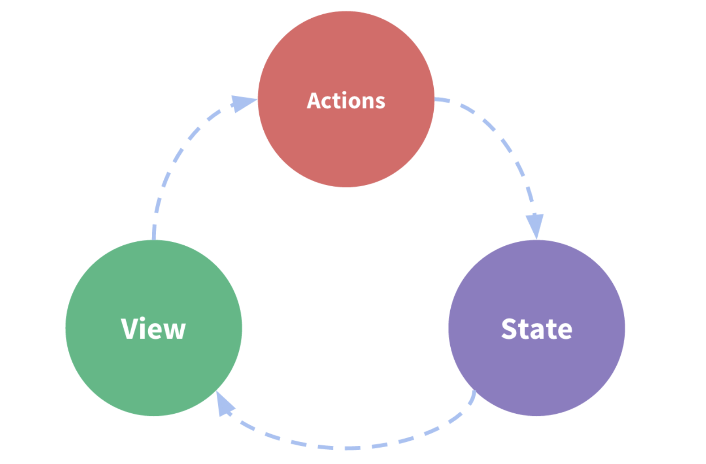
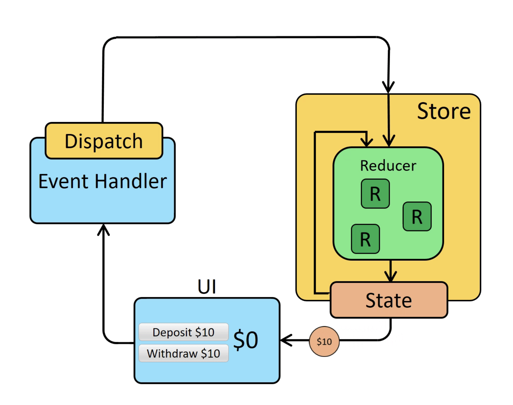

# Redux

## Goals
1. Redux? 
2. 단방향 상태관리 시스템의 이해 
3. Redux 사용해서 system 이해하기
  

## Redux란? 
- 전역 상태 state 관리 lib로 복잡한 상태 관리 및 Tree 밖의 상태값을 가져올 때 사용되는 lib이다. 

Redux와 React는 독립적인 lib로써, 두가지를 연결해주는 도구가 React-Redux다.

**단방향 상태관리 시스템의 이해**
1. 계속되서 변경되는 데이터가 있다. 
2. 상태를 위한 단 하나의 근원이 필요할 때
3. 최상위 컴포넌트가 더 이상 상태를 관리하는 것이 적절하지 않을 때

## 시스템의 이해와 단방향 상태관리 

- 단 방향의 상태관리 시스템이다.   
UI View(화면 상태값의 변화) -> 상태값 변경되었을 때 Action 객체전달 -> State 에서 변경 -> 다시 view 값 전달


- state 상태는 항상 같은 장소에서 관리된다. 관리 되는 곳을 store라고 명칭한다.
- 상태 변경은  Action을 통해서만 전달 할 수 있다.
- 변경은 순수함수로부터 변경 가능하다. 아래 reducer의 내용에서 확인하자
  
### Redux in Reducer??? 


 
React에서 Reducer는 많이 들어봤다. useReducer() Hook에서  useState대신 사용하는
Hook이다. 상태값과 상태를 어떻게 변경할지 판단후 새로운 state를 반환하는 개념이 여기서도 똑같다. 

1. View에서 상태값이 변경되었다.
2. 변경된 상태값을 dispath가 받아 action 객체와 함께 store로 전달한다.
3. store안에서  action에 맞는 state 값을 다시 UI로 전달한다. 
   
여기서 Reducer는 상태값과 이행되는 action에 대한 값으로 상태를 변경하여 리턴하는 역할을 전달한다.

--- 

## **use Redux(Redux 사용하기)**

---
### 목표 

1. Redux, React-Redux 설치하기
2. state를 저장하고있는 store 생성하기
3. state를 변화주는 Reducer 만들기
4. Provider 컴포넌트 설정해주기
5. useSelector로 store의 state 값 가져오기
6. 이벤트 state 값 변경 및 적용하기


-----


1. 설치

```bash
$ npm install @reduxjs/toolkit react-redux
$ npm i redux react-redux
```

2. state를 저장하고있는 store 만들기
- store는 state를 관리하는 객체로 변화가 생기면 안되니깐 const로 정의하자
- state를 새로 정의하하는 리턴하는 function 타입으로 가진다.

```js 
import { createStore } from 'redux';

const store = createStore(reducer)
```

3. Reducer 만들기
- 역할 : 현재의 state를 가지고있고, action(어떻게 state를 변화를 줄 지)에 따른 state 값을 리턴한다.
-  현재 객체의 불변성을 유자시켜줘야 한다. 
   -  why? : 현재 상태의 state의 변화를 계속 준다면 어디서 변화가 생겼는지  확인 할 수 없다. 기존 state값은 유지하고 새로운 state를 만들어서 전달한다.

```js
function reducer(currentState, action){

//현재 state가 없는 경우의 최초 값을 지정한다
if(currentState === undefined){
  currnetState = {
    num: 1,
  }
}

// 리턴하는 state는 불변성에 의한 새로운 객체이다.
const newState = {..currentState} 

// action에 따른 state 변경사항을 정의해준다
if(action.type === 'aciton'){
  // state 변경 내용  작성
  newState.number++;
}

  return newState
}
```

4. Provider 컴포넌트 설정해주기
- 역할 : 어떤 컴포넌트에서 redux로 관리되고있는 state를 사용할지 정의해주는 역할이다.
- react-redux lib의 기능으로 다음과 같이 정의하자
- Component1,2,3에서 사용자가 정의한 state를 redux로 관리한다.
- **Provider 컴포넌트에는 어떤 store를 사용 할 것인지 Attribute로 정의해야한다.**

```js
import {Provider} from 'react-redux'
import { createStore } from 'redux';


const store = createStore(reducer)

function App(){
  return (
    <>
      <Provider store={store}>
        <Component1/>
        <Component2/>
        <Component3/>
      </Provider>
    </>
  )
}
```

5. useSelector로 store의 state 값 가져오기 
-  useSelector :  현재 필요한 state의 값을 가져온다.
-  useSelector는 함수를 변수로 받고, 해당 함수를 통해서 현재의 state의 값을 받는다.


```js 
import { Provider, useSelector, useDispatch } from 'react-redux'

// store,  reducer 생략

function App(){
  return(
    <Provider store={store}>
      <Component1/>
    </Provider>
  )
}

function Component1(){
  
  // state를 받아 리턴하는 함수 정의 
  function getNumberState(state) {
    // 어떤 state 값을 가져올지 정의한다
    return state.number
  }
  
  // state를 가져오는 함수를 변수로 전달하여 state값을 가져온다.
  const number = useSelector((getState));
  // Arrow Function으로 정의하면 가독성이 좋아진다.
  // const number = useSelector((state) => state.number);

  // 현재 상태의 state를 출력하는 부분
  return(
    <div>
      <span>{number}<span>
    </div>
  )
}

```

6. 이벤트 state 값 변경 및 적용하기(useDispatch())
- 이벤트 발생 즉, UI변경으로 인한 state값을 변경해서 사용하기
- useDispath는 함수를 리턴하고 리턴된 함수는 reducer를 호출한다.
- action object이고 object의 type으로 값을 설정하고 해당 설정에 대한 state 값에 변화를 준다.

```js
function reducer(currentState, action) {
  
  // action에 따른 state 변경사항을 정의해준다
  if(action.type === 'PLUS'){
    // state 변경 내용  작성
    newState.number += 1;
  }

  return newState
}


function Component2(){

import { Provider, useSelector, useDispatch } from 'react-redux'

const dispatch = useDispatch();

  return(
    <div>
        // action은 object이다.
       <button onClick={() => {dispatch({type: 'PLUS'})}}>(Number + 1) Button</button>
    </div>
  )
}
```


